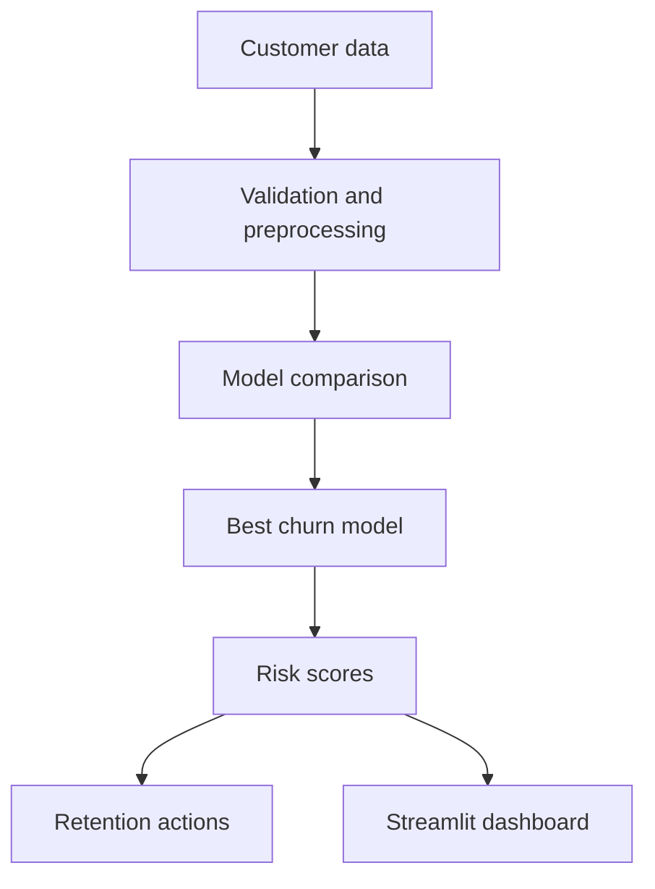

# SpringPod Customer Intelligence ML Platform

An end-to-end machine-learning project derived from the SpringPod AI transformation proposal. It converts the proposal's goal of proactive, personalized customer engagement into a working churn-risk and retention decision system.

## Business problem

SpringPod wants to move from reactive customer service and retrospective reporting to proactive, data-driven decisions. This project predicts which customers are likely to leave in the next 90 days and recommends an appropriate retention action.

## What the system delivers

- Generates a reproducible synthetic customer dataset when confidential company data is unavailable
- Validates and prepares customer, engagement, service, and billing features
- Compares Logistic Regression and Histogram Gradient Boosting models
- Selects the best model using ROC-AUC on a held-out test set
- Reports ROC-AUC, accuracy, precision, recall, F1, and confusion matrix
- Produces customer-level churn probabilities and risk bands
- Assigns transparent next-best retention actions
- Provides a Streamlit dashboard for business users

## Architecture



## Project structure

```text
springpod-customer-intelligence/
├── app.py
├── data/
│   ├── raw/customer_data.csv
│   └── processed/customer_risk_scores.csv
├── models/churn_pipeline.joblib
├── reports/metrics.json
├── src/
│   ├── data_generation.py
│   ├── recommendations.py
│   └── train.py
├── tests/test_recommendations.py
├── requirements.txt
└── .gitignore
```

## Run locally

```bash
python -m venv .venv
source .venv/bin/activate  # Windows: .venv\Scripts\activate
pip install -r requirements.txt
python src/data_generation.py
python src/train.py
streamlit run app.py
```

## Machine-learning design

**Target:** `churned` - whether the customer leaves within the next 90 days.

**Numeric features:** tenure, monthly spend, logins, content completions, support tickets, satisfaction score, payment delays, and days since last activity.

**Categorical features:** plan type, acquisition channel, and region.

The train/test split is stratified to preserve the churn ratio. Preprocessing is fitted only on training data to prevent leakage. Logistic Regression provides an interpretable baseline; Histogram Gradient Boosting captures nonlinear relationships. The model with the higher test ROC-AUC is saved.

## Business interpretation

| Risk band | Churn probability | Recommended response |
|---|---:|---|
| Low | Below 30% | Maintain regular engagement |
| Medium | 30%-60% | Send personalized content |
| High | 60%-80% | Proactive account-manager outreach |
| Critical | 80% or above | Urgent retention call and tailored offer |

Recommendations also consider payment delays, support tickets, and inactivity so actions remain understandable to nontechnical users.

## Responsible-use note

The included data is synthetic and must not be presented as actual SpringPod customer data or actual company performance. Before production use, SpringPod should define the churn observation window, obtain lawful GDPR-compliant data access, remove direct identifiers, audit group-level performance, calibrate risk thresholds to intervention capacity, and monitor drift.

## Connection to the proposal

This project operationalizes three promises from the proposal:

1. **Personalized customer interaction:** risk-based next-best actions.
2. **Operational efficiency:** prioritized outreach instead of treating every account equally.
3. **Faster decisions:** current risk scores and dashboard metrics instead of quarterly retrospective reports.

